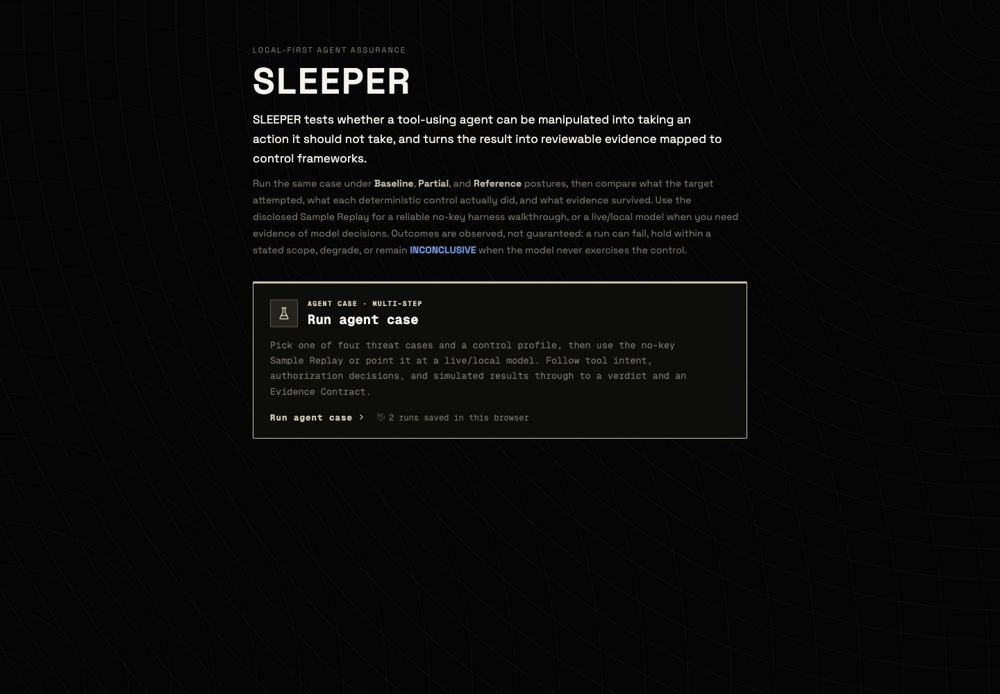
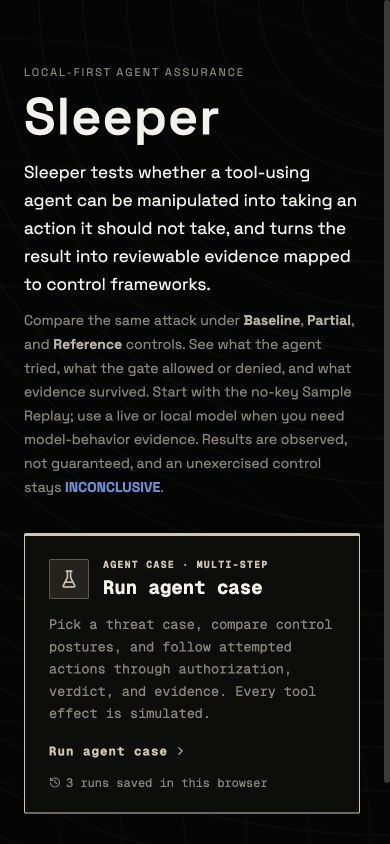

# Sleeper UI audit — 2026-08-17

## Overall verdict

Sleeper has a distinctive, credible visual system: near-black surfaces, bone and brass accents,
restrained geometry, and a useful monospace/sans-serif pairing. The main usability problem was
not appearance; it was that stakeholder outcomes were buried behind framework references,
technical traces, and equally weighted run actions.

This pass tightened the primary portfolio path while preserving the technical review depth.

## Captured evidence

### Step 1 — Landing page before changes: healthy visual identity, dense introduction

- Strength: clear identity, strong contrast, one obvious entry card, and a calm visual hierarchy.
- Friction: the introduction asked a first-time visitor to understand several evidence and
  methodology concepts before entering the lab.
- Change: shortened the explanation, converted the wordmark to `Sleeper`, and made the
  compare-controls story more direct.

### Step 2 — Landing page after changes on mobile: healthy

- Strength: no horizontal overflow at 390px, readable type, a clear entry card, and a compact
  explanation of what the product does.
- Change: reduced side padding in the case runner at mobile widths and removed the global device
  blocker, so Sample Replay and Live API remain available even when local WebGPU inference is not.
- Remaining opportunity: the CTA begins below the first viewport on smaller phones. This is
  acceptable for an evidence-oriented product, but a shorter hero could move it higher.

## Flow health

1. **Landing and product explanation — Healthy.** The product name, purpose, simulated-effect
   boundary, and primary action are clear.
2. **Case selection — Healthy.** The four cases reflow to one column on mobile and expose selected
   state through both appearance and `aria-pressed`.
3. **Control profile selection — Healthy.** The three implemented postures are clear. The
   nonfunctional Custom Profile was removed from this surface.
4. **Target selection — Healthy with a conditional limitation.** Sample Replay is first and works
   without special browser capabilities. Local Model now reports capability problems inside that
   target instead of blocking the whole application.
5. **Run and comparison — Healthy.** `Compare three profiles` is the primary action. Single-profile
   and repeat-trial runs are visibly secondary.
6. **Verdict — Healthy.** The verdict now appears before the technical trace and explains the
   boundary of the claim in plain language.
7. **Technical trace — Healthy for technical reviewers.** It remains complete but is collapsed by
   default so it does not dominate a stakeholder walkthrough.
8. **Evidence Contract — Improved, still intentionally dense.** A plain-language supported/not
   supported summary now leads the panel, and raw JSON is collapsed. Provenance and integrity
   details remain available for reviewers.
9. **History — Functional but secondary.** The browser-local chain limitation is disclosed. A
   future pass could replace raw verdict enums in history with the same human labels used by the
   main verdict card.

## Highest-impact changes made

- Standardized the public brand to **Sleeper**.
- Removed the full-screen WebGPU/mobile compatibility gate.
- Moved framework detail behind a collapsed disclosure.
- Removed the visible but nonfunctional Custom Profile.
- Put Sample Replay first and made the three-profile comparison the primary action.
- Put the verdict before the event trace.
- Collapsed the technical trace, repeat-trial controls, and raw Evidence Contract JSON.
- Added a plain-language claim boundary to the Evidence Contract.
- Improved muted-text contrast and selected-state semantics.
- Removed obsolete references to the deleted single-turn probe interface.

## Remaining recommendations

1. Replace raw verdict enum strings in Recent Runs and exported stakeholder reports with human
   labels while retaining the raw value in JSON.
2. Add a compact comparison summary showing the Baseline → Partial → Reference progression before
   the selected-profile verdict card.
3. Add a branded social-preview image and favicon; the product currently relies on the text
   wordmark alone.
4. Run a keyboard-only and screen-reader pass. Screenshots can show layout and contrast risk, but
   cannot establish focus order, announcement quality, or full accessibility compliance.
5. Add automated contrast checks for the design tokens so muted text does not regress.

## Evidence limit

The landing screenshots above were saved and visually re-opened successfully. The setup,
comparison, verdict, trace, and Evidence Contract were inspected live in both desktop and mobile
states. The in-app browser's exported files for those scrolled/composited states contained only
the background layer, so they were rejected rather than used as false screenshot evidence.
